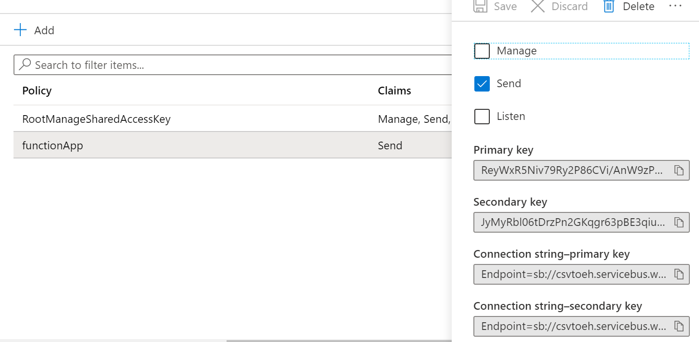

# CSVBlobToEventHub
Function to copy data from CSV and submit via function to Event Hubs

This project is a function app that collects CSVs from Blob and injects the rows one at a time into an Event Hub instance with optional delay. This is written in C# but you could achieve the same in other languages.

## Introduction

There are several pieces involved in writing a function app using triggers, inputs and outputs. You'll need to know about the following:

* Triggers
* Input Bindings
* Output Bindings
* Async apps

In addition to this, you'll need to configure the infrastructure, publish the function, and integrate the other components with bindings and app settings.

### Triggers and bindings

A trigger will be what causes your Function to run. An Input is optional, and used to collect data if your trigger does not provide it. Outputs are where your data is sent by the function. A full list of bindings can be found at [functions-triggers-bindings](https://docs.microsoft.com/en-us/azure/azure-functions/functions-triggers-bindings) and each one links to a full page of documentation explaining how to use that binding.

### Async Apps

Some triggers will start an app and have no data, for instance a timer. Others will start an app with one piece of data. In this scenario, the app will do something with the data and then when the app is finished, the data is returned to the output binding and the app terminates. This is also the case with HTTP responses where a single response is required. Finally, you may have a trigger which provides multiple data in an array. In this instance you cannot simply return the data and terminate the app since you need to process all of the data. Here you should configure the app as async and return the data piece by piece until you run out and only then terminate the app. Each trigger, input and output will detail the ways of using it, but you may need to look carefully to notice the async keyword.

This example [from the Event Hub documentation](https://docs.microsoft.com/en-us/azure/azure-functions/functions-bindings-event-hubs?tabs=csharp#output) shows the return method if you have one output:

```CSHARP
[FunctionName("EventHubOutput")]
[return: EventHub("outputEventHubMessage", Connection = "EventHubConnectionAppSetting")]
public static string Run([TimerTrigger("0 */5 * * * *")] TimerInfo myTimer, ILogger log)
{
    log.LogInformation($"C# Timer trigger function executed at: {DateTime.Now}");
    return $"{DateTime.Now}";
}
```

And this example [from the Event Hub documentation](https://docs.microsoft.com/en-us/azure/azure-functions/functions-bindings-event-hubs?tabs=csharp#output) shows the async method where you use an IASyncCollector object to iterate through data:

```CSHARP
[FunctionName("EH2EH")]
public static async Task Run(
    [EventHubTrigger("source", Connection = "EventHubConnectionAppSetting")] EventData[] events,
    [EventHub("dest", Connection = "EventHubConnectionAppSetting")]IAsyncCollector<string> outputEvents,
    ILogger log)
{
    foreach (EventData eventData in events)
    {
        // do some processing:
        var myProcessedEvent = DoSomething(eventData);

        // then send the message
        await outputEvents.AddAsync(JsonConvert.SerializeObject(myProcessedEvent));
    }
}
```

Note the "public static async Task" which will also need [System.Threading.Tasks](https://docs.microsoft.com/en-us/dotnet/api/system.threading.tasks?view=netframework-4.8) to be added to the code to support the methods used.

## Setup

This demo will require the following components:

* Function App
* Storage Account (Blob Containers)
* Event Hub

Optionally, you may also want to use Stream Analytics and Power BI to visualise the data, but I won't go into those here. You'll be able to see data hitting the Event Hub and can use [Service Bus Explorer](https://github.com/paolosalvatori/ServiceBusExplorer) to view the messages on the bus.

### Function App

In the Azure portal, create a new Function App


Create a new resource group for the demo called functionAppDemo and give your function a name such as csvToEH, you may want to add the date to make it unique. Select .NET Core as the runtime for this demo.


On the hosting tab leave the defaults in place for this demo, you may change these in production.


Click review and create and then create to complete setup.

### Storage Account

In the Azure portal, create a new Storage Account


Select the same FunctionAppDemo resource group, give the storage account a name such as csv followed by the date, then select LRS for the storage tier. Click review and create then create.


Once the storage account has finished deploying, open it and click Containers.


Click add container and create a container called csvblobs. This container will be where we upload CSV files later to send through the function app.


Finally, click Access Keys on your storage account and copy the connection string


This will be used as an app setting in the function app later.

### Event Hub

In the Azure Portal, create a new Event Hubs instance


Name the Event Hubs namespace and choose standard pricing tier. Select the same resource group and region.


Click Create.

Once deployed, open your event hub and click new Event Hub


Give the hub a name such as csvtoEH and click create


Now click Shared Access Policies and click Add


Call the policy functionApp so that you remember what you are granting access to, then give the policy send permission.


Once created, click the policy and copy the connection string. This will be used as an app setting for the Function App later on.



### App Settings

Now that you've configured the storage and event hubs, open your Function App and go to Configuration


Click on New Application Setting


Configure a setting called csvblobstore and paste your storage account connection string from above in the value


Now create a setting called eventhubconnection and paste your event hub connection string from above


These settings are explained below in the function.json section but are used to connect to the services.

## The Code

### Project

Open Visual Studio and select Create New Project


Search for and select a new Azure Functions project using C#


Give your project a name and location and click create


Select Blob as your trigger and choose none for storage Account since we'll use the Azure Storage account created earlier. Name your connection string setting csvBlobStore and your path csvblobs, the same as the container you created. Click create to create the project


### Install modules

Once the project loads, right click on the project name in solution explorer and choose Manage NuGet Packages


Search for and install the Microsoft.Azure.WebJobs.Extensions.EventHubs package to install the Event Hubs binding


### host.json

This file simply lists the version and sets up the Event Hub extension to be used by the app as per the documentation. It's pretty self explanatory but is necessary to be added or the extension is not recognised. This file is for the whole project so you only need to do this once for all of the included functions you create.

```json
{
  "version": "2.0",
    "extensions": {
      "eventHubs": {
        "batchCheckpointFrequency": 5,
        "eventProcessorOptions": {
          "maxBatchSize": 256,
          "prefetchCount": 512
        }
      }
    }
}
```

### function.json

This file is not in the project and is not editable. There will be one for each of your functions. It's created at build time by the compiler, based on C# attributes in the code (the parts in square brackets). An example is included here for reference. As you can see, this includes the blob trigger created with the project. It does not include the output binding, but instead specifies that this will be taken from attributes (code in square brackets) at runtime.

```json
{
  "generatedBy": "Microsoft.NET.Sdk.Functions-1.0.29",
  "configurationSource": "attributes",
  "bindings": [
    {
      "type": "blobTrigger",
      "connection": "csvblobstore",
      "path": "csvblobs/{name}",
      "name": "myBlob"
    }
  ],
  "disabled": false,
  "scriptFile": "../bin/CSVBlobToEH.dll",
  "entryPoint": "CSVBlobToEH.Function1.Run"
}
```

From our source code, we have the input attribute:

```csharp
[BlobTrigger("csvblobs/{name}", Connection = "csvblobstore")]Stream myBlob
```

This is what sets up the binding in the function.json file, and you can see the names will match, with the connection string csvblobstore being the name of the app setting we must use to configure the Blob connection string.

Next, we have the following output attribute:

```csharp
 [EventHub("dest", Connection = "eventhubconnection")]IAsyncCollector<string> outputEvents
```

This is where the app setting for the Event Hub is configured, so we need to create an app setting called "eventhubconnection" with the connection string in it. This is not stored in the function.json file, but is read directly by the app instead.

These settings are the ones you configured earlier in the function app on the portal.

### Local.Settings.json

This file simply overrides settings for use locally. Think of this as the location you configure application settings for debugging the code. Set these to the same values as the application settings you configured earlier.

```json
{
  "IsEncrypted": false,
  "Values": {
    "csvblobstore": "<enter your CSV source blob connection string here>",
    "eventhubconnection": "<enter your event hub connection string here",
    "FUNCTIONS_WORKER_RUNTIME": "dotnet"
  }
}
```

### Function1.cs

At the top of the function, we set up the trigger, in this case BlobTrigger, using a connection with the name csvblobstore. This connection is configured either in your local settings if testing locally, or in the Function App settings in Azure. We set this up as a Stream variable named myBlob which means we can just treat it as a file in C#. We also set up the Event Hub output as an IAsyncCollector which we can write output events to. The whole function is async here as we will be sending multiple outputs from one input.

```CSHARP
public static class Function1
    {
        [FunctionName("Function1")]
        public static async Task Run([BlobTrigger("csvblobs/{name}", Connection = "csvblobstore")]Stream myBlob, [EventHub("dest", Connection = "eventhubconnection")]IAsyncCollector<string> outputEvents, string name, ILogger log)
```

Next, we write to the log some useful information. This is straight from sample code and not necessary but is recommended for troubleshooting. If you're wanting to tweak for performance you may want to leave this out if you're very confident in the app code and happy to use other methods for troubleshooting. We then set up a StreamReader to read the Blob line by line to process the CSV file. Please note that I included no code at all to check that we have a valid CSV file. This demo is all about setting up a function app so I left out everything but that.

```CSHARP
        {
            log.LogInformation($"C# Blob trigger function Processed blob\n Name:{name} \n Size: {myBlob.Length} Bytes");
            using (var reader = new StreamReader(myBlob))
            {
```
Next, we read the first line and assume it's a header. If it wasn't, the JSON would use the first row as headers regardless and end up with some weird attribute names. Again, this is a minimum viable product to show Function Apps. We split the line by comma and create an array.

```CSHARP
                //Read the first line of the CSV file and break into header values
                var line = reader.ReadLine();
                log.LogInformation("headers: " + line);
                var headers = line.Split(',');
```
Because it's useful to have a stream of events last for a while I added a delay, defined here. If you don't do this Event Hubs will just suck up all of the rows immediately (it's very capable!) so you won't get ongoing events for testing of other technologies. I made this app for testing events in Stream Analytics or PowerBI or some other Event Hub driven thing, maybe CosmosDB too.

```CSHARP
                //Define the sleep interval in milliseconds, use 0 if you don't want to wait, or remove the sleep command below
                int delayTime = 1000;
```
Next, we do a while loop to read the remainder of the file line by line and make another array of the values. Since we want the rows to be sent as a JSON one at a time to create many events from one file, we set up an empty string. There are certainly ways to use Newtonsoft functionality to create JSON from an object, but since CSV is 2D data it's easy enough to manually create it. For each line, we add the current time to simulate a transaction time and then we also add the columns and values one at a time in a for loop. The final value can't have a comma in JSON so we add it outside the loop without the comma.

```CSHARP
                //Read the rest of the file
                while (!reader.EndOfStream)
                {
                    //Create an empty string for our JSON
                    string outputJSON = "";
                    outputJSON = outputJSON + "{\n";
                    
                    //Read our lines one by one and split into values
                    line = reader.ReadLine();
                    var values = line.Split(',');
                    log.LogInformation("Values: " + line);
                    
                    //Add a datestamp to the data
                    outputJSON = outputJSON + "  functionDateStamp: \"" + DateTime.Now.ToString() + "\",\n";

                    //Add all of the data except the last value
                    for (int i = 0; i < (values.Length - 1); i++)
                    {
                        outputJSON = outputJSON + "  \"" + headers[i] + "\": \"" + values[i] + "\",\n";
                    }
                    //Add the last value without a comma to properly form the JSON
                    int j = values.Length - 1;
                    outputJSON = outputJSON + "  \"" + headers[j] + "\": \"" + values[j] + "\"\n";
                    //Close the JSON
                    outputJSON = outputJSON + "}";
```
Finally we add outputJSON, the string we created to the outputEvents variable, which is our output binding to Event Hubs. We do this with an await command to spawn a new thread task to avoid delaying the next line being processed. The main thread then carries on and reads the next line without delay. This makes the app extremely performant.

```CSHARP
                    await outputEvents.AddAsync(outputJSON);
                    log.LogInformation("Added: " + outputJSON);
```
We then sleep the main thread (optionally) to spread the events out. Don't put this in a real Function as it does nothing useful in the real world. Event Hubs will easily accept your events at whatever speed you supply them!

```CSHARP
                    //Sleep the function to delay the next event (otherwise it's really fast!)
                    System.Threading.Thread.Sleep(delayTime);
                }
            }
        }
    }
```

### Publish

Right click on the project under Solution Explorer and select Publish


Select "Select Existing" to browse for your function app


Select your function app from the list and click OK


Finally, click Publish to push your code to the Azure service


## Testing

To test the app, create a file in Excel and set up several columns with hundreds of rows or use the file [here](data/randomdata.csv). Upload this to your blob container and the function app will find it and start pushing the rows to your Event Hubs instance as individual events.
